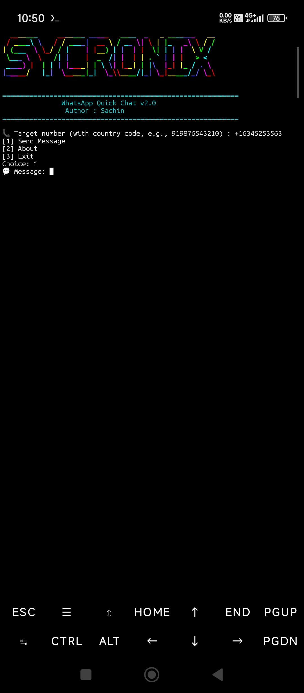

# 💬 WhatsApp Quick Chat

Send WhatsApp messages without saving contacts directly from your terminal.

## 📸 Preview




## ✨ Features

- Send messages without saving contacts
- Works on Termux (Android)
- Works on Linux
- Works on macOS
- URL encoding support
- Interactive menu
- Lightweight and fast

---


## 📦 Installation

### Termux

```bash
pkg update -y
pkg install git toilet -y

git clone https://github.com/officialsycronix/whatsapp-quick-chat.git

cd whatsapp-quick-chat

chmod +x wa.sh

./wa.sh
```

### Linux

```bash
sudo apt update
sudo apt install git toilet -y

git clone https://github.com/officialsycronix/whatsapp-quick-chat.git

cd whatsapp-quick-chat

chmod +x wa.sh

./wa.sh
```

### macOS

```bash
brew install git toilet

git clone https://github.com/officialsycronix/whatsapp-quick-chat.git

cd whatsapp-quick-chat

chmod +x wa.sh

./wa.sh
```

---

## 🚀 Usage

```bash
./wa.sh
```

Enter:

- Target number with country code
- Message
- Select Send Message

WhatsApp will open automatically.

---

## 📜 License

MIT License

---

## 👨‍💻 Author

SYCRONIX

GitHub:
https://github.com/officialsycronix

