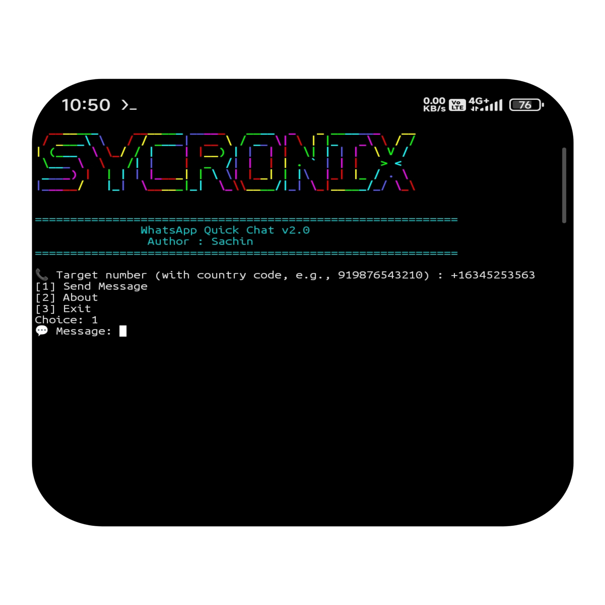

# 💬 WhatsApp Quick Chat

Send WhatsApp messages without saving contacts directly from your terminal.

## 📸 Preview




## ✨ Features

- Send messages without saving contacts
- Works on Termux (Android)
- Works on Linux
- Works on macOS
- URL encoding support
- Interactive menu
- Lightweight and fast

---


## 📦 Installation

### Termux

```bash
pkg update -y
pkg install git toilet -y

git clone https://github.com/officialsycronix/whatsapp-quick-chat.git

cd whatsapp-quick-chat

chmod +x wa.sh

./wa.sh
```

### Linux

```bash
sudo apt update
sudo apt install git toilet -y

git clone https://github.com/officialsycronix/whatsapp-quick-chat.git

cd whatsapp-quick-chat

chmod +x wa.sh

./wa.sh
```

### macOS

```bash
brew install git toilet

git clone https://github.com/officialsycronix/whatsapp-quick-chat.git

cd whatsapp-quick-chat

chmod +x wa.sh

./wa.sh
```

---

## 🚀 Usage

```bash
./wa.sh
```

Enter:

- Target number with country code
- Message
- Select Send Message

WhatsApp will open automatically.

---

## 📜 License

MIT License

---

## 👨‍💻 Author

SYCRONIX

GitHub:
https://github.com/officialsycronix
=======
# 📱 WhatsApp Quick Chat

> Send WhatsApp messages **without saving contacts** – straight from your terminal.

 
 


## ✨ Features

- ✅ Prefill message – opens WhatsApp Web/App automatically
- ✅ Works on **Termux** (Android), **Linux**, **macOS**
- ✅ URL encoding – handles spaces, emojis, special characters
- ✅ Loop menu – send multiple messages without restart
- ✅ Colored banner (falls back if `toilet` missing)

## 📦 Installation

### Termux (Android)
```bash
pkg update && pkg upgrade
pkg install toilet git
git clone https://github.com/SYCRONIX/whatsapp-quick-chat.git
cd whatsapp-quick-chat
chmod +x wa.sh
./wa.sh

sudo apt install toilet git
git clone https://github.com/SYCRONIX/whatsapp-quick-chat.git
cd whatsapp-quick-chat
chmod +x wa.sh
./wa.sh

brew install toilet git
git clone https://github.com/SYCRONIX/whatsapp-quick-chat.git
cd whatsapp-quick-chat
chmod +x wa.sh
./wa.sh

# Run the script
./wa.sh

# Then follow the interactive prompts:
# Enter target number with country code (e.g., 919876543210)
# Choose option 1 (Send Message)
# Type your message
# WhatsApp opens automatically with prefilled text


📞 Target number (with country code, e.g., 919876543210) : 919876543210
[1] Send Message
[2] About
[3] Exit
Choice: 1
💬 Message: Hello, this is a test message
Opening WhatsApp for +919876543210...

